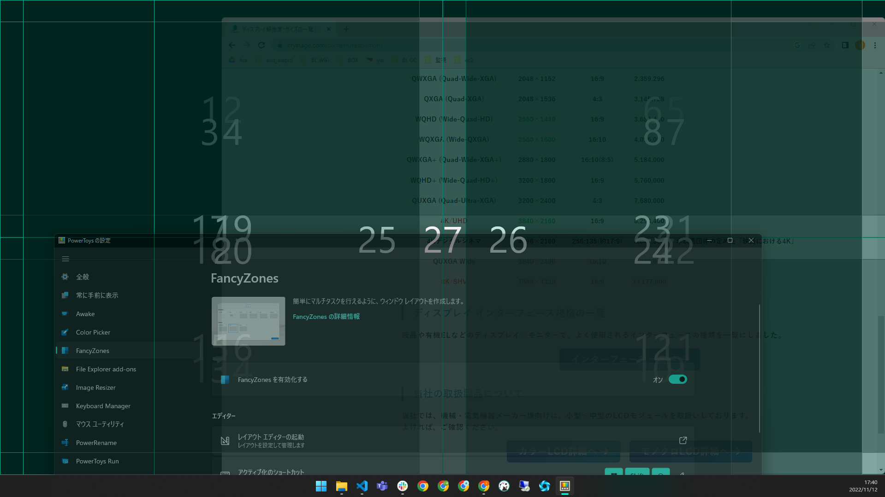
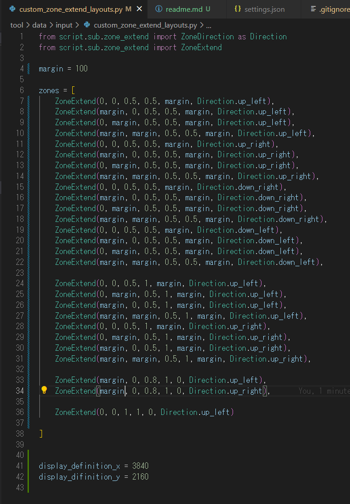

tool for PowerToys FancyZones

before use , set .env and layout_settings.py

↑↑↑

# how to use

1. create some custom layouts of canvas.
2. create ".env" from ".env copy".
3. edit .env path.
4. create "main.py" from "main copy.py".
5. edit main.py.
6. run main.py.

python 3.10 or later, maybe.
